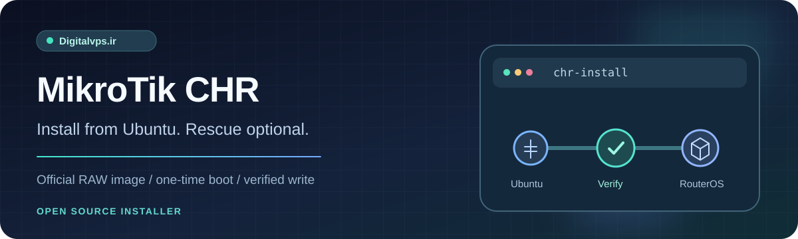
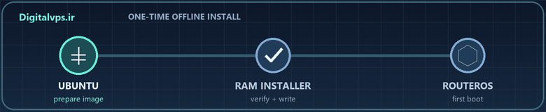

<div align="center">



<h1>Install MikroTik CHR on an Ubuntu VPS</h1>

<p><strong>Start from a running Ubuntu VM. Provider Rescue is optional.</strong><br>Official image download, one-time offline boot, disk write, and read-back verification.</p>

<p>
  <a href="#install-live"></a>
  <a href="LICENSE"></a>
  <a href="https://mikrotik.com/download/chr"></a>
</p>

<p>
  <a href="#install-live">Ubuntu install</a> ·
  <a href="#install-rescue">Rescue install</a> ·
  <a href="#plans">Services and prices</a> ·
  <a href="README.md">فارسی</a>
</p>

</div>

> [!CAUTION]
> **This replaces Ubuntu and erases every partition on the target disk.** Verify an off-server backup, the exact disk, and working provider console/VNC access first. A real VPS CHR boot and network test is still outstanding; use a disposable VM before relying on this workflow for an important server.

## 🧭 Choose a path

| Your environment | Mode | What happens |
| --- | --- | --- |
| Ubuntu is running; provider Rescue is unavailable | **Default live mode** | The next boot writes the disk before Ubuntu mounts its root filesystem. |
| Independent Rescue is available; target disk is unmounted | **`--mode rescue`** | Writes and verifies the offline disk immediately. |

<div align="center">

</div>

This is a **fresh RouterOS CHR installation**, not an upgrade of an existing router. It uses the official **x86_64 RAW** image from MikroTik. It does not migrate Ubuntu's IP address, gateway, password, or firewall to CHR.

<a id="install-live"></a>
## 🚀 Install from Ubuntu without Rescue

**Required:** an x86_64 VM using **Legacy BIOS**, Ubuntu with GRUB and `initramfs-tools`, **2 GiB RAM recommended**, enough free space in `/tmp` and `/boot`, and a working provider console. The script rejects a guest reporting less than 1 GiB `MemTotal`; a nominal 1 GiB plan may fail that check. The installer stops in UEFI mode. Do not run it on the Virtualizor host or in a container.

Inspect the disk and boot mode before proceeding:

```bash
lsblk -o NAME,TYPE,SIZE,FSTYPE,MOUNTPOINTS,MODEL
findmnt -no SOURCE /
if test -d /sys/firmware/efi; then echo UEFI; else echo BIOS; fi
```

Install dependencies, download the standalone script, and review it before running as root:

```bash
sudo apt-get update
sudo apt-get install -y curl unzip util-linux coreutils busybox initramfs-tools grub2-common
curl -fL https://raw.githubusercontent.com/Digitalvps-Ir/Mikrotik-Ubuntu/main/script.sh -o script.sh
less script.sh
sudo bash script.sh --version 7.24.4
```

When a single root disk can be identified, the installer displays it for confirmation. Otherwise, specify the **whole Ubuntu root disk**, for example `--disk /dev/vda`, not a partition such as `/dev/vda1`. Type the exact displayed phrase, such as `ERASE /dev/vda`, to continue.

The VM reboots automatically after staging. At the next boot, the dedicated initramfs writes the image **before Ubuntu root is mounted**, compares every image byte with the disk, and reboots into CHR. Watch both boots in the provider console. Ubuntu SSH will disconnect.

<details>
<summary>Cancel a staged installation before its first reboot</summary>

```bash
sudo bash script.sh --cancel-live
```

The script normally reboots immediately after staging; this command only helps while the machine has not started the installer boot.

</details>

<a id="install-rescue"></a>
## 🛟 Install from Rescue

Use an independent Rescue environment with the target disk and its partitions **unmounted**. On Ubuntu/Debian-based Rescue, install the basic tools and inspect the disk:

```bash
sudo apt-get update
sudo apt-get install -y curl unzip util-linux coreutils busybox
lsblk -o NAME,TYPE,SIZE,MOUNTPOINTS,MODEL
curl -fL https://raw.githubusercontent.com/Digitalvps-Ir/Mikrotik-Ubuntu/main/script.sh -o script.sh
less script.sh
sudo bash script.sh --mode rescue --disk /dev/vda --version 7.24.4
```

`/dev/vda` is an example. After `byte-for-byte verification succeeded`, disable Rescue in the provider panel and power cycle the VM. If `/tmp` is too small, set `--workdir /path` on storage **outside the target disk**.

## 🧩 Releases and compatibility

| Selection | Status on 27 September 2026 | Note |
| --- | --- | --- |
| `7.24.4` | Stable | Example in the commands above |
| `7.23.7` | Long-term | Select with `--version 7.23.7` |
| `6.49.22` | Legacy | Use only for compatibility needs; read CHR v6 limits. |

Any **numeric** official 6.x or 7.x version can be passed with `--version`, including future releases when MikroTik publishes a matching RAW archive. Check the [official CHR downloads](https://mikrotik.com/download/chr). Non-numeric beta/development labels are not accepted. Accepting a version number does not certify boot compatibility on every hypervisor.

| Project boundary | Details |
| --- | --- |
| Architecture and firmware | x86_64 and Legacy BIOS for this installation path |
| Ubuntu disk selection | Target must contain Ubuntu root; automatic detection requires one root disk |
| First-boot network | Use the provider console and the actual service IP, prefix, gateway, and NIC |
| Verification | ZIP/image checks, optional trusted ZIP digest via `--sha256`, disk read-back comparison |
| Real-world testing | CI and an initramfs build pass; real VPS CHR boot and network access remain unverified |

<a id="plans"></a>
## 🌐 Digitalvps.ir services and current prices

Check the [official Digitalvps.ir client portal](https://client.digitalvps.ir/) for current MikroTik VPS and other service specifications, availability, and prices. Plan prices and resources change, so this README does not publish a static price or unverified service promise.

Before ordering a plan for this installer, ask support whether that plan offers **Legacy BIOS, a compatible virtual disk, provider console access, and CHR boot support**. Availability of a VPS plan alone does not establish compatibility with this installation method.

## 🔐 First CHR boot

Use the provider console and set a strong password for `admin` immediately; a fresh official image can start without a password. Configure interface, IP/prefix, gateway, DNS, and management access restrictions for your actual VPS network. Do not assume DHCP or working SSH after the disk write.

## 🛠 Troubleshooting

| Symptom | Next check |
| --- | --- |
| Target disk is mounted or in use | In Rescue, inspect target mounts and swap. From running Ubuntu, use default live mode. |
| Ubuntu root disk not detected | Inspect `findmnt` and `lsblk`; pass `--disk` only for the **root disk**. |
| UEFI or GRUB error | This installer path needs Legacy BIOS and GRUB; inspect firmware and boot settings in the panel. |
| Download or ZIP error | Check version and access to `download.mikrotik.com`; disk writing has not started. |
| Write or comparison error | The disk may be incomplete. Diagnose via console/Rescue and do not boot it. |
| CHR boots without network | Inspect the real NIC, MAC, IP/prefix, and gateway from the console. |

Report script bugs in [GitHub Issues](https://github.com/Digitalvps-Ir/Mikrotik-Ubuntu/issues). Remove passwords, customer IPs, serials, and account data from logs first.

## 📚 References

- [Official CHR downloads and current releases](https://mikrotik.com/download/chr)
- [Official CHR installation guide](https://manual.mikrotik.com/docs/getting-started/installation-and-upgrade/install/chr-installation/)
- [Official CHR licensing](https://manual.mikrotik.com/docs/getting-started/routeros-licensing/chr/chr-licensing/)
- [MIT License](LICENSE)

<div align="center"><strong>Digitalvps.ir</strong> · independent open-source CHR installer</div>
